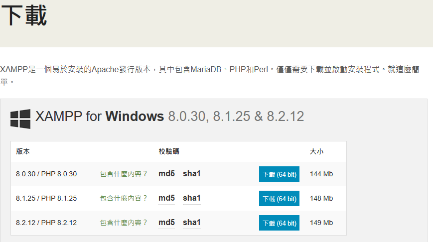
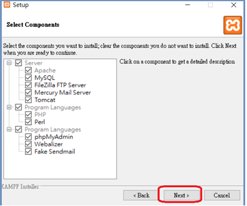
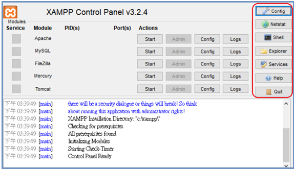
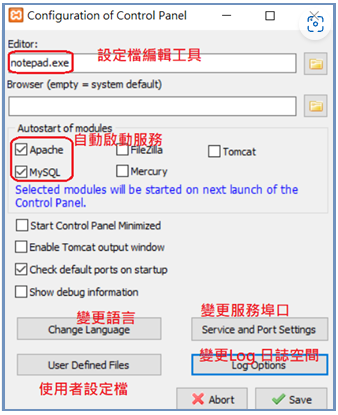
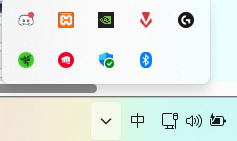
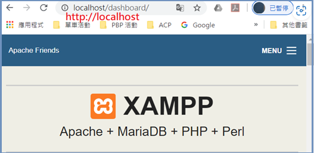
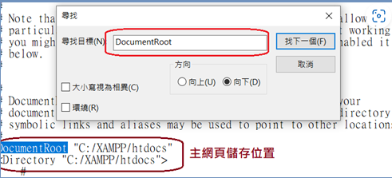

# 生鮮食品公司管理系統

生鮮食品公司管理系統操作手冊

1.	開發目的：
隨著我們公司業務的快速發展和市場需求的不斷變化，我們迫切需要一個全面、高效的管理系統，以優化我們的業務流程、提高工作效率，並確保我們的產品品質和客戶滿意度。為此，我們提出開發一個專門針對生鮮食品行業需求的管理系統。以下是此系統開發的主要目的：

1. 提升客戶管理效率
•	管理和查看所有客戶信息。

2. 提升貨物監控度
•	查看和管理進貨記錄。
•	檢視所有客戶訂單詳情。

3. 查看應收帳款
•	管理應收帳款資訊。

4. 執行跨資料酷的查詢
•	整合和分析多個資料庫信息。 

2.硬體環境：
任何能安裝xampp和vscode及執行的電腦或筆電

3.軟體環境：
Xampp 和 vscode

4.系統安裝步驟：

步驟一：利用 Google 搜尋 XAMPP 官方網站
(Download XAMPP (apachefriends.org)。

步驟二：下載後執行 (xampp-windows-x64-7.4.6-0-VC15-installer )：(大多不用變更僅按入 Next 鍵即可)

步驟三：系統說明
完成後即出現 XAMPP 控制台(Control Panel)，其中包含了五個服務系統，如下：
   Apache 網頁伺服器(Web Server)：提供網頁儲存與瀏覽，網址為：http://localhost。系統內還包含 PHP Engine、Perl 解譯與 phpmyadmin 資料庫管理介面等等。
   MySQL 資料庫伺服器(Database Server)：此為 MariaDB 資料庫系統(取代早期的 MySQL)，可在此建立多個資料庫，可透過 PHP-MySQL 連結存取。至於資料庫管理大多由 phpmyadmin 介面處理。
FileZilla 檔案伺服器 (FTP Server)：不須使用
   Mercury 郵件伺服器 (Mail Server)：不須使用
   Tomcat JSP 連結 (Java Server Page Connect)：不須使用

主控台操作

主控台有七個主功能鍵
1.config : 

2.Netstat : 顯示網路狀態

3.Shell : 開啟外殼命令操作視窗

4.Explorer : 開始檔案管理視窗

5.Service : 開始系統服務視窗

6.Help : 開啟線上操作手冊

7.Quit : 離開主控台，但並沒有關閉服務，要從右下角的地方關閉

接著要變更主網頁文件位置
啟動 Apache 伺服器後，可直接由瀏覽器取得主網站網頁，網址是 http://localhost

XAMPP 預定主網頁儲存於 <C:\XAMPP\htdocs> 目錄下，但 <C> 磁碟機大多儲存系統執行檔案較多， 通常會改變到其他位置，假設希望變更到 <F:\htdocs> 目錄下，則操作如下：
1.	由XAMPP主控台的config 去開啟http.conf設定檔案
2.	尋找到文件中的DocumentRoot

自行更改。
接著是設定mysql帳號密碼

由xampp主控台開啟命令操作視窗，找到shell，假設設定密碼為 < 123456 >，則命令是 <mysqladmin --user=root password "123456"

接著修改 root 帳號登入phpmyadmin的密碼，由xampp主控台開啟apache的config.inc.php設定檔案，將root密碼設定為123456

重新啟動apache

再次進入 http://localhost/phpmyadmin 就有了

5.各項功能之操作描述

我的頁面分為六個，分別是登入，客戶基本資料，公司進貨資料，客戶訂貨紀錄，公司應收帳款，跨資料庫整合。

登入成功後

有五個頁面可選擇

先進入客戶基本資料，總共有5個功能，分別是新增，刪除，修改，查詢，顯示所有，每個按鈕點擊下去後就會出現分別的表單

其他所有的頁面使用方式一樣

6.線上錯誤訊息
在使用中會遇到一些問題，就是主鍵衝突，例如我客戶基本資料已經存在一筆身分證為F123456789，如果要再插入就會出現錯誤。此時若要修改資料應該選擇修改資料功能

